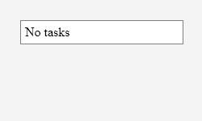
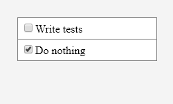

# Proof of concept

Create png "snapshots" from react components based on jsdoc @snapshot tag

## Example run

```
node index.js -f example/**/*.js
```

## Example test

```js
/**
 *
 * @param {{tasks:Array}} props
 * @snapshot "Empty" {"width": 250, "height": 150}
 * return <ToDoList
 *      tasks={[]}
 * />;
 * @snapshot "Tasks" {"width": 250, "height": 150}
 * return <ToDoList
 * 		tasks={[{
 * 			checked: false,
 * 			text: 'Write tests'
 * 		}, {
 * 			checked: true,
 * 			text: 'Do nothing'
 * 		}]}
 * />
 */
export function ToDoList(props) {
	const { tasks } = props;
	return (
		<ToDoListWrapper>
			{(!tasks || tasks.length === 0) && (
				<ToDoListElement>No tasks</ToDoListElement>
			)}
			{tasks &&
				tasks.map((task, i) => (
					<ToDoListElement key={i}>
						<input type="checkbox" checked={task.checked} />
						{task.text}
					</ToDoListElement>
				))}
		</ToDoListWrapper>
	);
}
```

Results:



